# Steps for setting up Appium Server GUI, Appium Inspector, and Android Studio
<hr/>

## Prerequisites:

- Have IntelliJ installed 
<hr/>

### Step One: Java 8

First, you are going to want to install [Java 8](https://www.oracle.com/java/technologies/javase/javase8-archive-downloads.html).
Android Studio uses Java 8 which is why we need this earlier version of Java. It is okay if you already 
have a newer version. You can have multiple versions of Java on your machine at once. Make sure to install
the one that is right for your OS and note where it is being stored. 
<b> This will be important for later when we set path and environment variables. </b>  

### Step Two: Android Studio

Now we can go ahead and install [Android Studio](https://developer.android.com/studio?gclid=CjwKCAiAqt-dBhBcEiwATw-ggHiU_q2ReT71goxpW6Ja8myoprAUdFcUp1h6u2vFaVqu1jG_kX5qYhoC0kEQAvD_BwE&gclsrc=aw.ds).
This is an IDE for developing Android applications that was made by JetBrains, which is why is looks so 
similar to IntelliJ. 

### Step Three: Setting path and environment variables for Windows
Now, we want to set path and environment variables so that we can use commands from the command line. 
These variables will also be used by the Appium Server GUI. To get to the window to edit your variables go
to Settings -> System -> About -> Advanced System Settings -> Environment Variables. Or simply type 
"Advanced System Settings" in your search bar and click the "Environment Variables" button. First, we need
to set some environment variables. Create the Java_Home variable and the Android_Home variable

[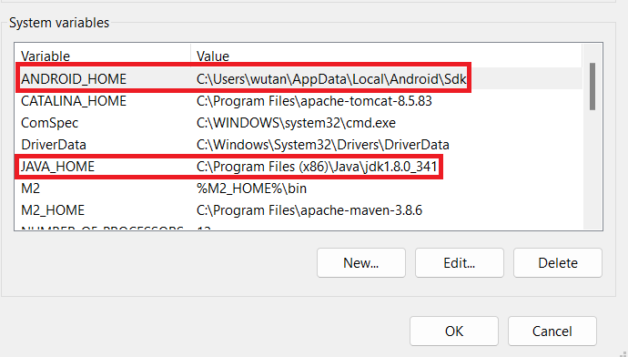](screenshots/java-home-and-android-home.png)

The location for you Java Jdk may be different. So be sure to check the exact location. You will also need
to edit the user for the Android_Home variable to be the user on your local machine. 

Next, we need to add a few path to our path variable. Locate the path variable among your System variables
as displayed below

[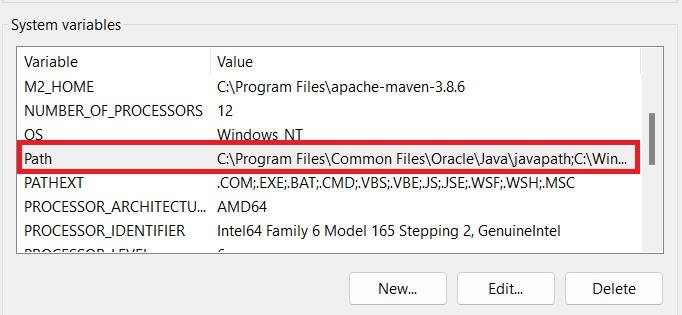](screenshots/path-variable.png)

From here, we are going to click on the path variable and add the following 
paths 

[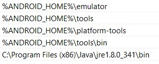](screenshots/new-path-variables.jpg)

These paths utilize the Android_Home variable that we set earlier. At this point, you're going to want to 
restart your machine so that you can use the path variables.

### Step Four: Download Appium Server GUI

At this point, we can go ahead and install the [Appium Server GUI](https://github.com/appium/appium-desktop/releases/tag/v1.22.3-4).
Make sure to install the one that is right for your OS. Find the Appium Server GUI on your desktop
and click on it. Click on the advanced settings tab and edit the Server Address to be "localhost". The Server
Port can remain the same as "4723". Make sure to check "Allow CORS". You can now save these settings as a 
preset so that they can be used for next time. 

[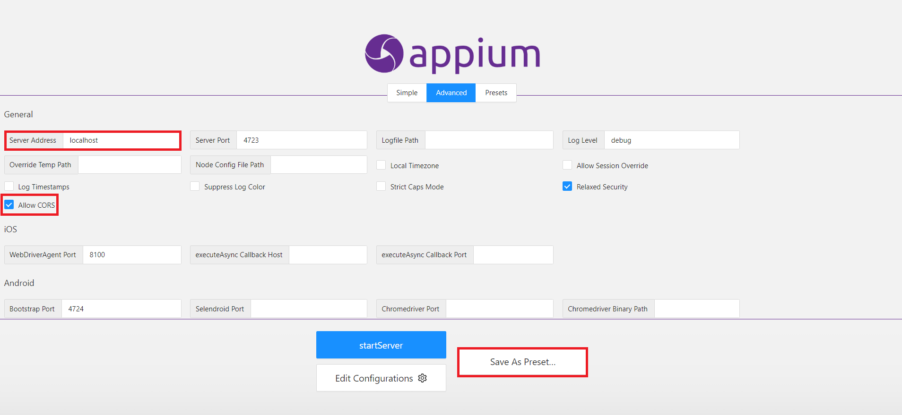](screenshots/Appium-advanced-settings-preset.png)

### Step Five: Run the emulator

We can now use those path variables that we set earlier. Go to your command prompt and type in:

```bash
emulator -list-avds
```
This will tell us which emulators are available to run our app.

[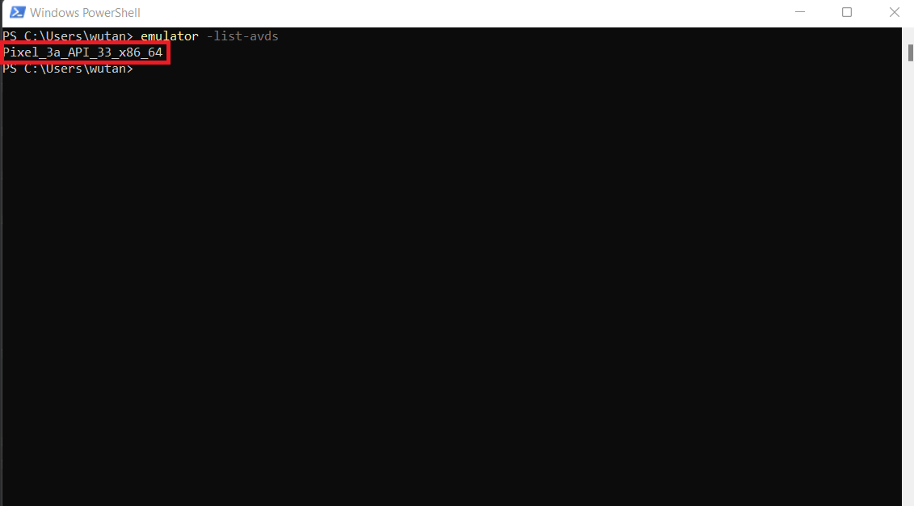](screenshots/available-emulators.png)

Now that we have the name of our device, "Pixel_3a_API_33_x86_64" in this case, we can use the following command to run 
the emulator:

```bash
emulator -avd Pixel_3a_API_33_x86_64
```

This will start this specific device. The emulator should then pop up

[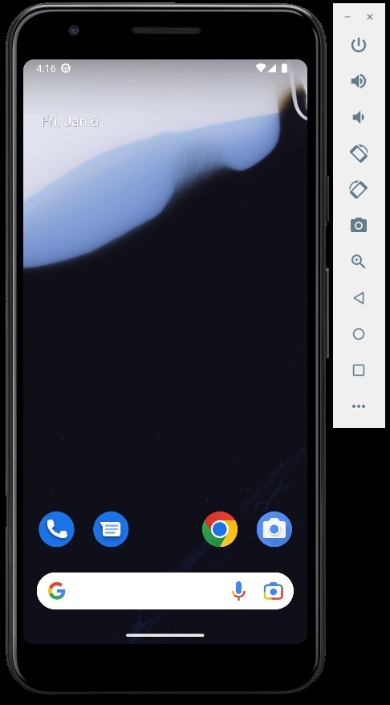](screenshots/emulated-device-on.jpg)


### Step Six: Download the Appium Inspector (Optional unless creating new project)

One last installation! Go ahead and install the [Appium Inspector](https://github.com/appium/appium-inspector/releases).
Make sure to install the one that is right for your OS. This part of the installation may be skipped if
the goal is to just run the tests as they are. If you have any questions about why the Appium 
Inspector is important and what it is used for, please see the [readme.md](readme.md) 

Since we cannot open our application in the browser and use the Developer Tools to inspect the html
structure of the applicaiton, we must use the Appium Inspector.We will also need to adjust some settings 
in order to get the Appium Inspector to communicate with the Appium Server. Change the Remote Host to 
"localhost" and change Remote port to "4723". It is also very important to add "/wd/hub" for the Remote Path
or else Appium Inspector will not be able to connect with the Appium Server. Next, we need to create and set
a few Desired Capabilities in order for the Appium Inspector to connect to the Android emulator (we will talk
about this more in shortly) and to run the app on the device. 

[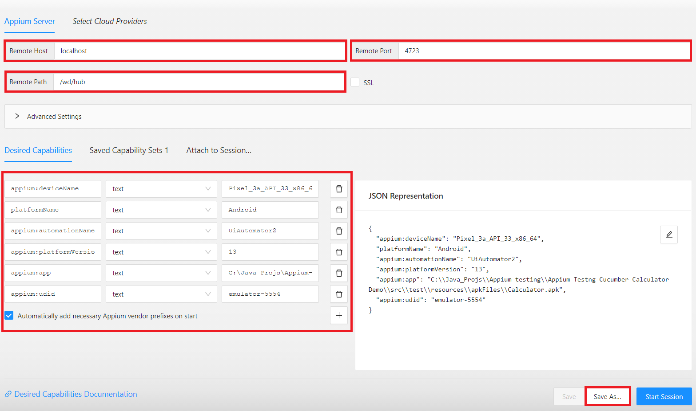](screenshots/appium-inspector-settings.png)

Use the name that you got before from the command prompt. In my case, the devices name was "Pixel_3a_API_33_x86_64". 
Create the deviceName capability and give it the name returned from the above command. My device is an Android, so for 
"platformName", I put Android. If your device is not an Android, put whatever device platform it is in this space. 
Android uses the "Uiautomator2" to run the emulator on the Appium Server. So, if your device is an Android, enter 
"UiAutomator2" for "automationName". In order to get the "platformVersion", we need to go back to the emulated device.
Go to the settings on the emulator and click "About emulated device". 

[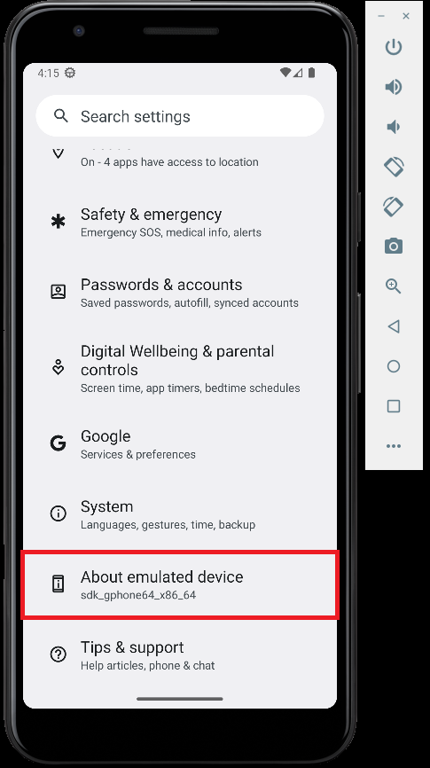](screenshots/about-emulated-device.png)

After this, scroll down until you see "Android version". In this case, it is version 13 for me.

[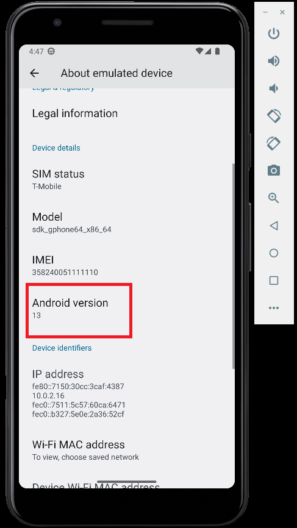](screenshots/android-version.png)

Copy this information into the "platformVersion" capability. Next, we need to specify the absolute path
to the apk file. This apk file is located within the resources file, but you still need to specify the
absolute path starting from the root directory of wherever you stored your project in. Put this information
into the "app" capability. Lastly, we need to find the "udid" for the device. Open a new command prompt 
window and type the command:

```bash
adb devices
```

This command will give us the "udid" of the device

[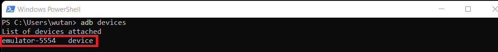](screenshots/device-udid.png)

For me, this value is "emulator-5554" which we can now add as our last capability. Be sure to save this set
of capabilities, so they can be used for another time. 

We've now set all our desired capabilities and are ready to start the inspector. If your Appium Server is 
not currently running, you should go back to the Appium Server GUI and hit the start server button. Now, go
to the Appium Inspector and start the session. As long as all the desired capabilities have been set correctly,
the Appium Inspector will take a few moments and bring us the following screen

[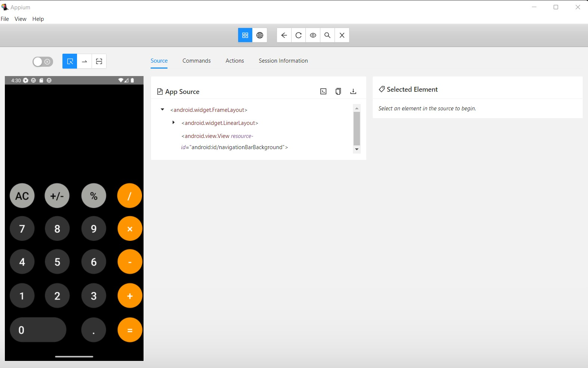](screenshots/appium-inspector-open.jpg)

Here we can see that the inspector has launched the Calculator application, and we are now able to interact
with it. If we click on the number 9, the location of the element will become visible, and we can see on 
the far right the id and the xpath for this element. 

[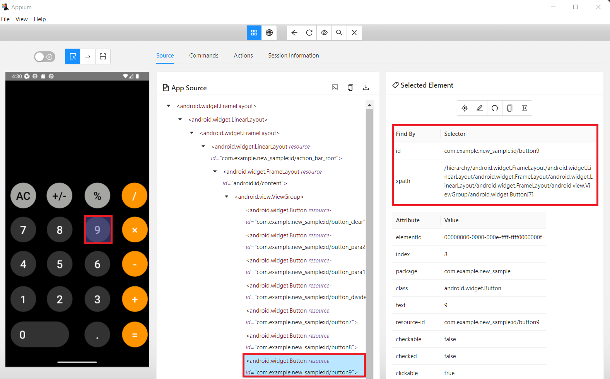](screenshots/appium-inspector-find-by.png)

This can be used in our automation testing when searching for the element we are trying to interact with. 
See the [CalculatorPage](src/test/java/com/testing/pages/CalculatorPage.java) for an example of how this is
done. Lastly, the Appium Inspector provides us with start-up code in the programming language of our choice.
Click on the Session Information button at the top of the screen, and then scroll down.

[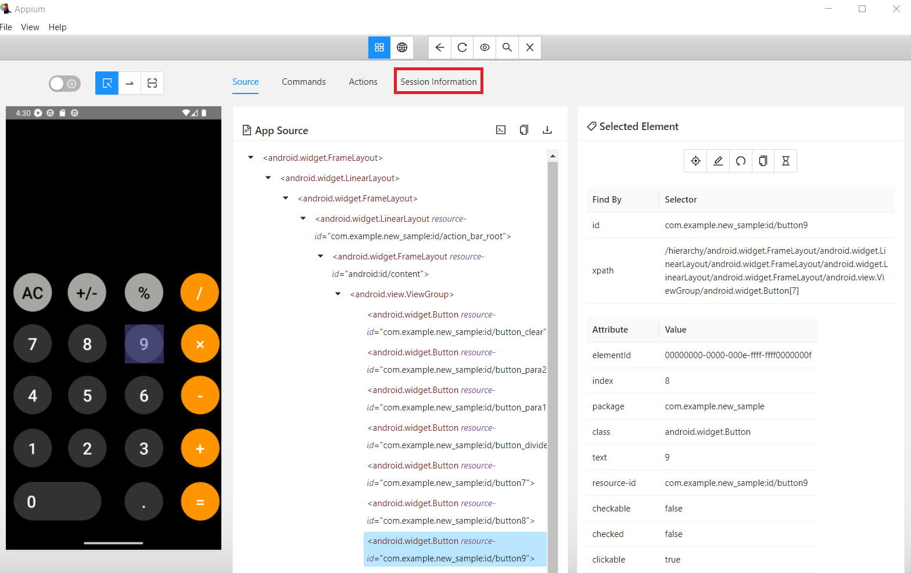](screenshots/appium-inspector-session-information.png)

Here we see that the Appium Inspector has provided us sample code that we can use to write our tests in 
Java using the Junit framework. In this project, we also added the testNG dependency so that we could use 
the @BeforeMethod and @AfterMethod annotations.

[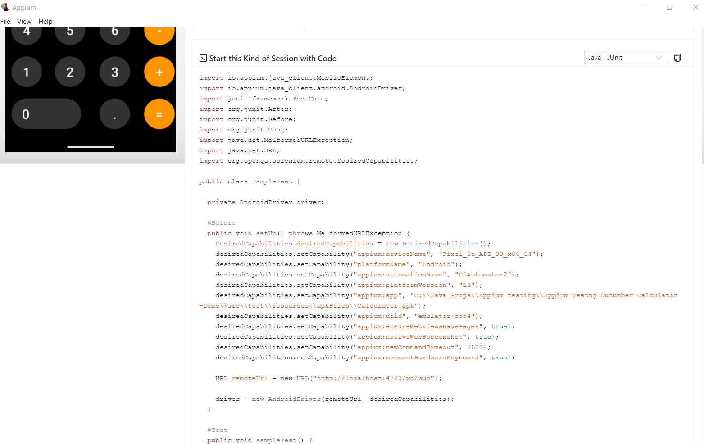](screenshots/appium-inspector-sample-code.jpg)

## Step Seven: All ready to test

Now that we have everything set up,  we can finally run our Appium tests. 
1. Go back to the Appium Server GUI and start the server if you have not started already
2. Make sure the emulator is still running
3. Go to whichever IDE you are using and open this project
4. Go to the Runner class and run the program
5. Watch on the screen of the emulator as the test runs!


